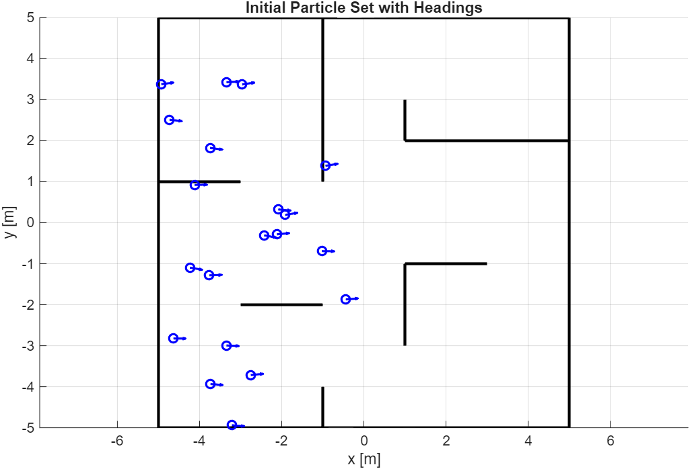
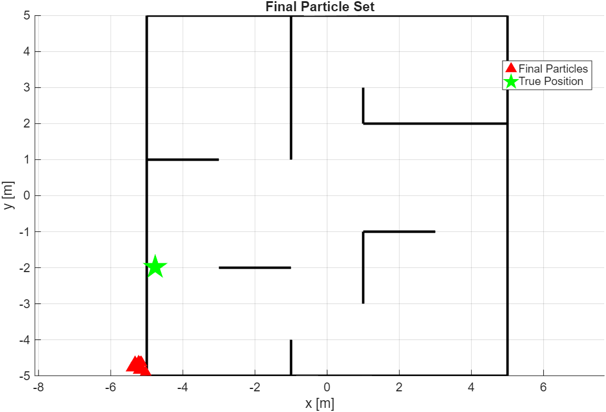
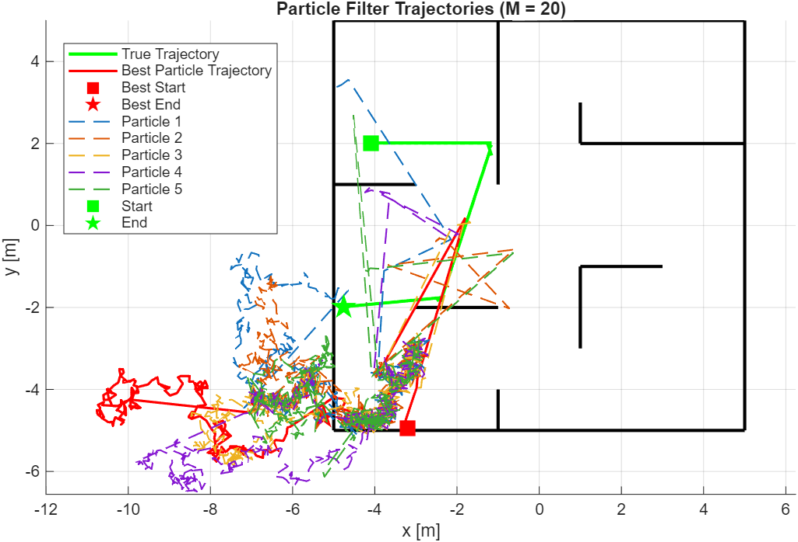
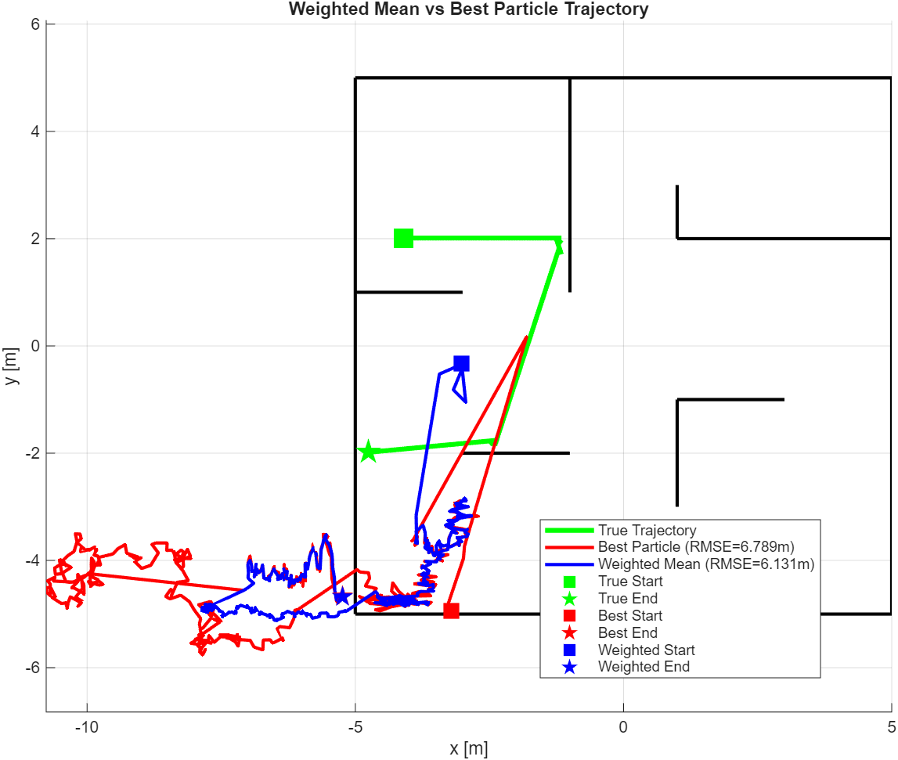
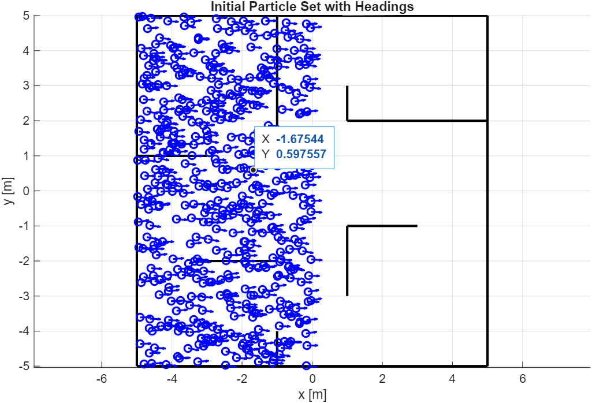
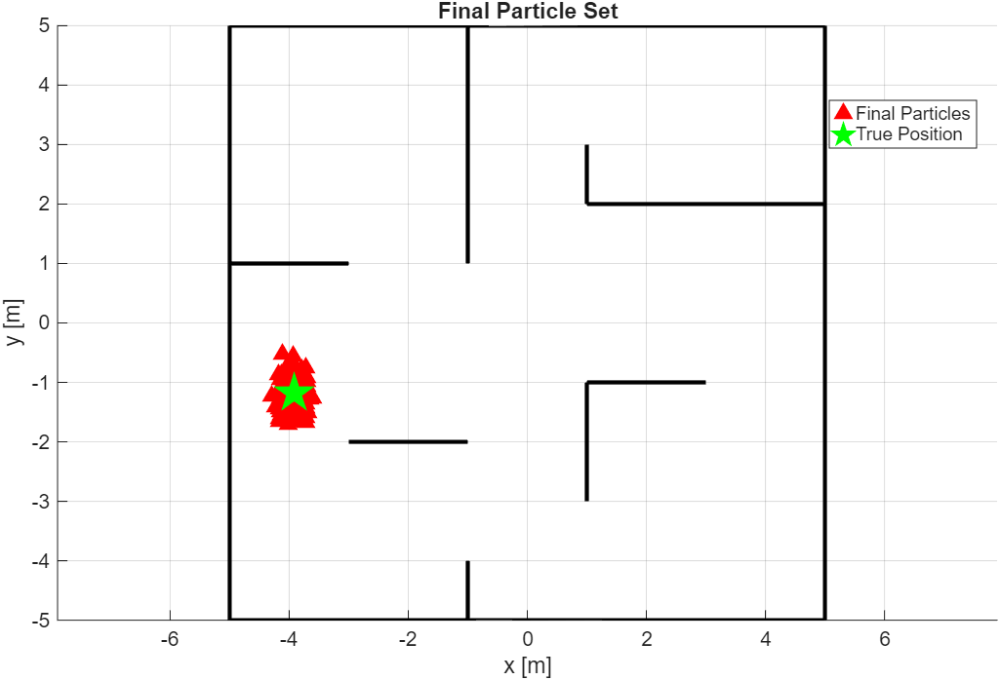
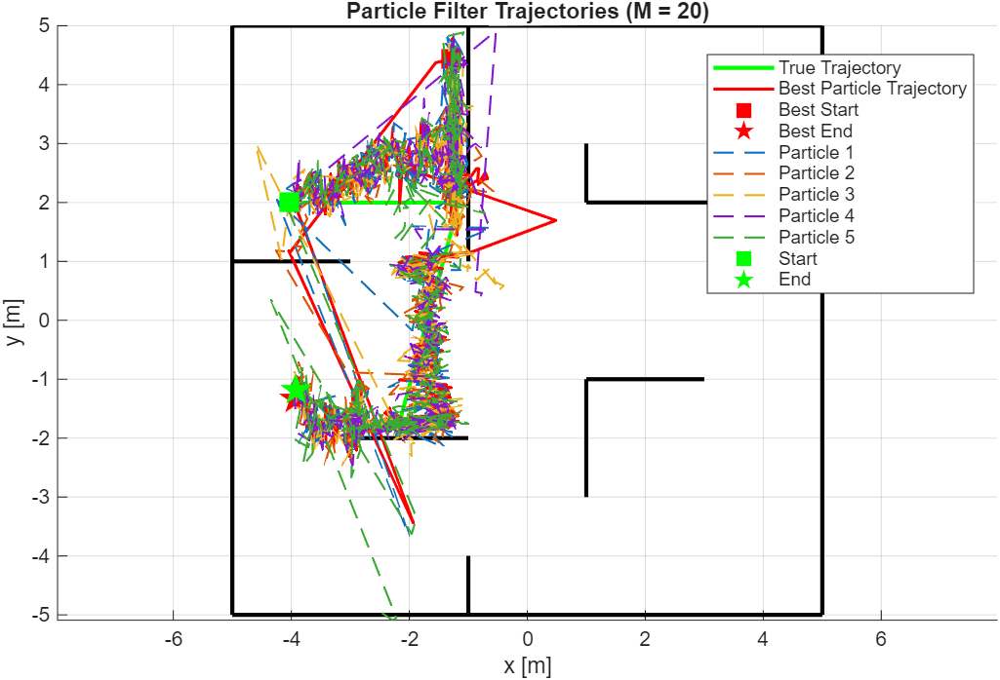
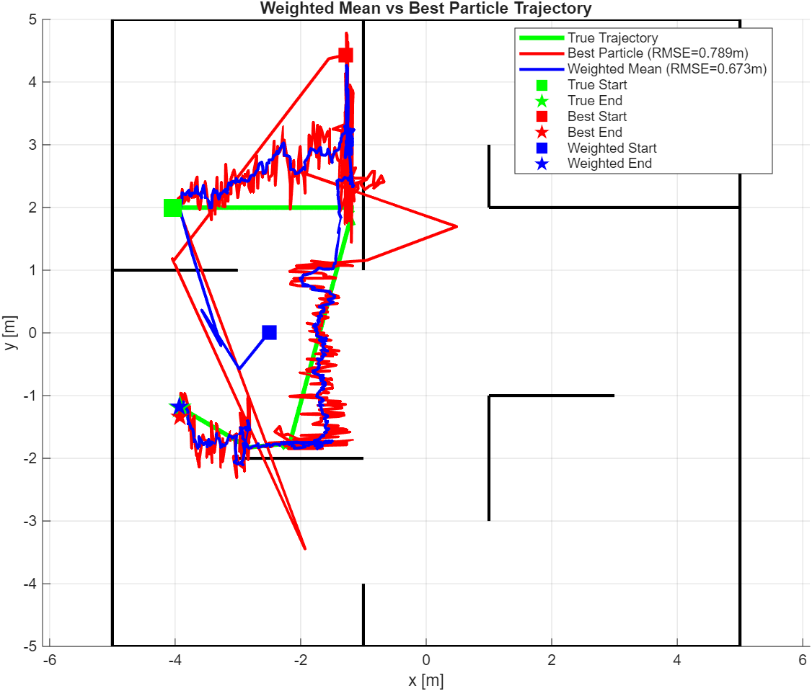

# Particle Filter in Robotics Localization

A MATLAB implementation of Particle Filter (Monte Carlo Localization) for autonomous mobile robot localization, developed as part of Cornell MAE 4180 (Autonomous Mobile Robots).

This project demonstrates how a particle filter can localize a robot in a known map using odometry and depth sensor measurements. Results are provided for **M=20** and **M=500** particles, showing how particle count affects localization accuracy.

## The Key Challenge: Sensor Likelihood P(z|x)

If you're implementing a particle filter and struggling with the sensor model (measurement likelihood), you're not alone -- this was the most confusing and error-prone part of the implementation.

### What is P(z|x)?

In the particle filter update step, each particle's weight is updated by:

```
w_i = w_i * P(z | x_i)
```

where:
- `x_i` is the state (pose) of particle `i`: `[x, y, theta]`
- `z` is the actual sensor measurement (vector of depth readings)
- `P(z|x_i)` answers: **"If the robot were really at pose x_i, how likely would it be to observe measurement z?"**

### How P(z|x) Works Step by Step

#### Step 1: Predict what the sensor *should* see from pose x

For each particle pose `x_i`, we **ray-cast** from the sensor position into the known map to compute predicted depth measurements `z_pred`:

```matlab
% predictDepth.m - Ray-casting for each sensor angle
for k = 1:K  % K sensor rays
    alpha = theta + angles(k);   % global ray direction
    dx = cos(alpha);
    dy = sin(alpha);

    % Find nearest wall intersection (Cramer's rule)
    for each wall segment in map:
        solve ray-wall intersection
        keep minimum positive t
    end

    depth(k) = min_t * cos(angles(k));  % project onto sensor axis
end
```

The `cos(angles(k))` projection converts range (distance along the ray) to **depth** (distance along the sensor's forward axis), matching what a real depth sensor reports.

#### Step 2: Compare predicted vs actual measurements

The innovation (error) between actual and predicted measurements:
```
innovation = z - z_pred
```

#### Step 3: Compute likelihood using multivariate Gaussian

```matlab
% Multivariate Gaussian likelihood
w = exp(-0.5 * innovation' * inv(Q) * innovation) / sqrt((2*pi)^n * det(Q))
```

where `Q` is the measurement noise covariance matrix (diagonal, with variance for each sensor ray).

### Common Pitfalls (Things That Tripped Me Up)

1. **Range vs Depth**: Real depth sensors report *depth* (perpendicular distance), not *range* (ray distance). You must project: `depth = range * cos(sensor_angle)`. Forgetting this causes systematic errors.

2. **Sensor position offset**: The sensor is NOT at the robot center. Transform sensor position from body frame to global frame:
   ```matlab
   px = x(1) + sensor_pos(1)*cos(theta) - sensor_pos(2)*sin(theta);
   py = x(2) + sensor_pos(1)*sin(theta) + sensor_pos(2)*cos(theta);
   ```

3. **Handling invalid measurements**: Sensor readings of 0, NaN, or beyond max range need special treatment:
   - In `mapLikelihood.m`: only use valid sensor rays for the likelihood computation
   - In `mapLikelihood_2.m`: clamp invalid values to `max_range` instead of discarding

4. **All weights going to zero**: If your noise covariance `Q` is too small, the Gaussian becomes extremely peaked and ALL particles get near-zero likelihood. The fix:
   - Increase `Q` (we used `Q = 0.001 * eye(K)` -- quite small but it worked)
   - Or add a minimum weight floor

5. **Angle convention**: Sensor angles go from +27 deg to -27 deg (left to right). Make sure your `linspace` direction matches the physical sensor layout.

### Two Sensor Model Implementations

We provide two versions of the sensor likelihood:

| File | Strategy for Invalid Rays | When to Use |
|------|--------------------------|-------------|
| `mapLikelihood.m` | Skip invalid rays, only compute likelihood on valid ones | More robust; uninformative rays don't hurt |
| `mapLikelihood_2.m` | Clamp invalid values to `max_range` | Simpler; penalizes particles that "see through walls" |

## Project Structure

```
.
|-- src/                        # MATLAB source code
|   |-- PF.m                   # Core particle filter (predict, update, resample)
|   |-- motionControl.m        # Main control loop with PF integration
|   |-- testPF.m               # Simple test with wall at y=1
|   |-- depthLikelihood.m      # P(z|x) for simple wall scenario
|   |-- mapLikelihood.m        # P(z|x) for general map (skip invalid)
|   |-- mapLikelihood_2.m      # P(z|x) for general map (clamp invalid)
|   |-- predictDepth.m         # Ray-casting depth prediction
|   |-- plotInitialParticles.m # Visualization: initial particle set
|   |-- plotFinalParticles.m   # Visualization: final particle set
|   |-- plotTrajectories.m     # Visualization: particle trajectories
|   |-- plotWeightedMean.m     # Visualization: weighted mean vs best particle
|   |-- plotMap.m              # Map drawing utility
|   |-- create_map.m           # Sphere world visualization
|   |-- readStoreSensorData.m  # Sensor data reader
|   |-- navigationPlot.m       # Navigation visualization
|   `-- defineSphereWorld.m    # Sphere world definition
|-- data/                       # Map and sensor data
|   |-- pf_20.mat              # Saved PF results with M=20
|   |-- pf_500.mat             # Saved PF results with M=500
|   |-- cornerMap.mat          # Map wall segments
|   |-- cornerMap.txt          # Map corners (text format)
|   |-- start1_dataStore.mat   # Sensor data from start position 1
|   |-- start2_dataStore.mat   # Sensor data from start position 2
|   `-- *.txt                  # Configuration files
|-- results/                    # Output visualizations
|   |-- M20/                   # Results with 20 particles
|   |   |-- Initial_20.png
|   |   |-- Final_20.png
|   |   |-- trajectory_20.png
|   |   `-- average_weight_20.png
|   |-- M500/                  # Results with 500 particles
|   |   |-- Initial_500.png
|   |   |-- Final_500.png
|   |   |-- trajectory_500.png
|   |   `-- average_weight_500.png
|   |-- Particle_Filter.png    # Algorithm concept diagram
|   `-- hw5bmap.png            # Map visualization
`-- README.md
```

## Results: M=20 vs M=500

### M=20 Particles

| Initial Particles | Final Particles |
|:-:|:-:|
|  |  |

| Trajectories | Average Weights |
|:-:|:-:|
|  |  |

### M=500 Particles

| Initial Particles | Final Particles |
|:-:|:-:|
|  |  |

| Trajectories | Average Weights |
|:-:|:-:|
|  |  |

With **M=500**, the particle filter converges much more reliably to the true robot pose. With **M=20**, there's a risk of particle depletion where no particle is close to the true state.

## Algorithm Overview

The particle filter in `PF.m` follows three steps each iteration:

1. **Prediction**: Propagate each particle through the motion model with added Gaussian noise
2. **Update**: Reweight each particle by `P(z|x)` -- the sensor likelihood
3. **Resampling**: Low-variance resampling to focus particles on high-likelihood regions

```matlab
% Core loop (simplified)
for i = 1:M
    particles(:,i) = g_func(particles(:,i), ut) + noise(:,i);  % predict
    weights(i) = weights(i) * p_func(particles(:,i), z, Q);     % update
end
weights = weights / sum(weights);                                 % normalize
particles = low_variance_resample(particles, weights);            % resample
```

## How to Run

1. Open MATLAB and navigate to the `src/` directory
2. For the simple wall test: run `testPF.m`
3. For the full map scenario: run `motionControl(Robot, maxTime)` with a Create robot object
4. For visualization of saved results: run `plotInitialParticles.m`, `plotFinalParticles.m`, `plotTrajectories.m`, or `plotWeightedMean.m`

**Note**: The plotting scripts load data from `.mat` files. Make sure the `data/` directory is on your MATLAB path, or copy the `.mat` files to `src/`.

## Acknowledgments

Developed for Cornell MAE 4180: Autonomous Mobile Robots.
